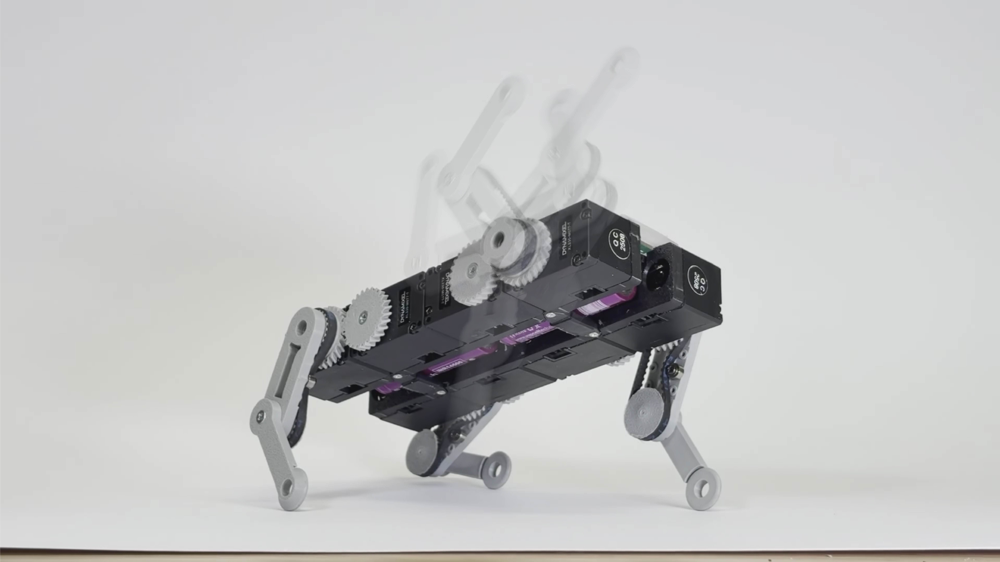
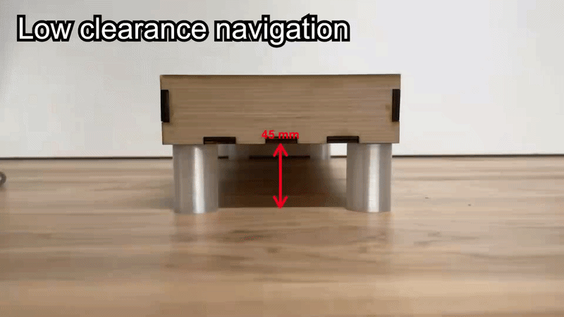
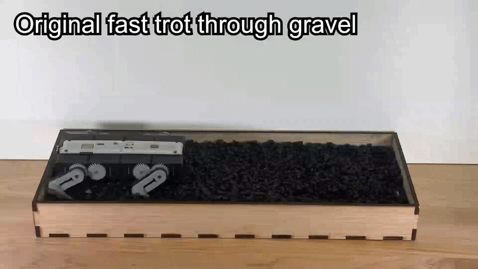
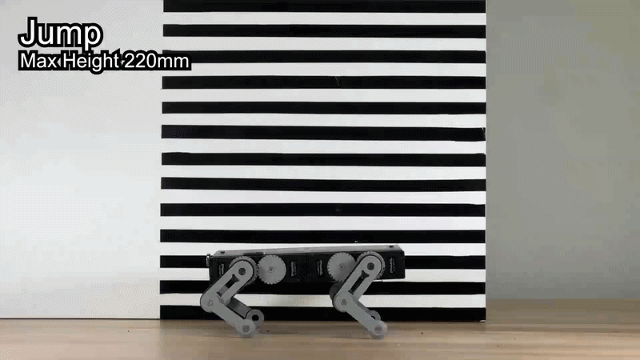
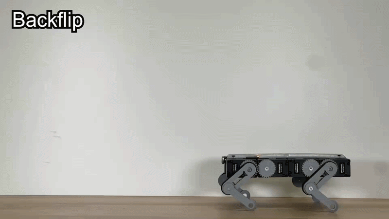

# MiNI-Q Quadruped Robot

MiNI-Q is a miniature, wire-free quadruped with unbounded, independently actuated leg joints developed at the [Robotics and Mechanisms Laboratory] (RoMeLa) at UCLA.  It is the design evolution of Q8bot and improves upon its predecessor by decreasing the form factor, integrating a BNO-055 IMU sensor, and upgrading the battery configuration from 1S to 2S.

The most notable difference between MiNI-Q and Q8bot is the introduction of a joint-limit-free leg mechanism, which uses a compound belt and gear drive train to drive a boundless 2R leg mechanism.  This design enables functionalities that were previous restricted by the parallel linkage mechanical constraints such as low crawling to squeeze through confined spaces, continuous rotation to navigate above loose substrate, and backflipping.

 

  
  
  
  
  

## Latest Update
We are working on providing a release version for this project.  We appreciate your patience.

## Publications
23rd Ubiquitous Robotics Conference 2026 Paper: [arXiv]

[arXiv]:https://arxiv.org/abs/2603.11537
[Robotics and Mechanisms Laboratory]:https://www.romela.org/
[Q8Bot]:https://github.com/EricYufengWu/q8bot

[Sourcing Components]:/docs/sourcing_components.md
[Assembling the Robot + Motor Config]:/docs/robot_assembly.md
[Software Setup]:/docs/software_setup.md